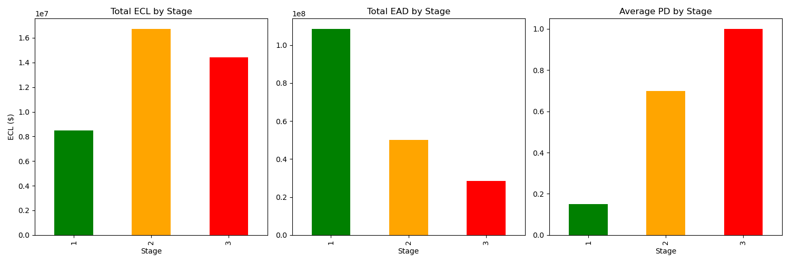
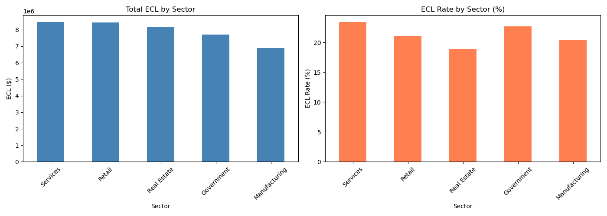
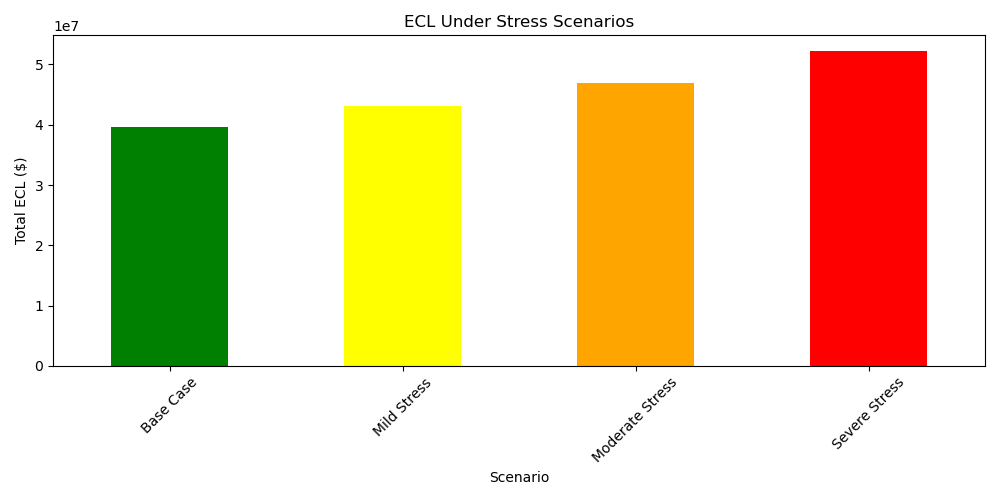

# IFRS 9 Expected Credit Loss (ECL) Calculator

  

## Overview
An IFRS 9 compliant ECL calculator built on a synthetic 1,000-loan portfolio.
Implements the three-stage impairment model with SAMA regulatory overlays,
sector concentration analysis, and stress testing — aligned with GCC banking standards.

---

## Business Problem
Under IFRS 9, banks must provision for expected credit losses across their
entire loan portfolio — not just loans already in default. This project
automates that provisioning process and flags regulatory breaches against
SAMA minimum thresholds.

---

## Methodology

```
Synthetic Loan Portfolio (1,000 loans)
           ↓
IFRS 9 Stage Assignment (DPD-based)
           ↓
PD Calculation (12-month vs Lifetime)
           ↓
ECL = PD × LGD × EAD
           ↓
SAMA Regulatory Overlay
           ↓
Sector Concentration Analysis
           ↓
Stress Testing (4 Scenarios)
           ↓
Excel Report Output
```

---

## Key Results

| Metric | Value |
|--------|-------|
| Total Portfolio EAD | $187,092,940 |
| Total ECL (Base Case) | $39,640,825 |
| SAMA Non-Compliant Loans | 32 |
| Additional Provision Required | $60,147.77 |
| Severe Stress ECL Increase | +31.74% |

---

## IFRS 9 Stage Distribution

| Stage | Loans | ECL |
|-------|-------|-----|
| Stage 1 (Performing) | 592 | $8,487,168 |
| Stage 2 (Underperforming) | 258 | $16,725,717 |
| Stage 3 (Non-Performing) | 150 | $14,427,940 |

---

## Stress Testing Scenarios

| Scenario | PD Multiplier | ECL Change |
|----------|--------------|------------|
| Base Case | 1.0x | — |
| Mild Stress | 1.2x | +8.69% |
| Moderate Stress | 1.5x | +18.20% |
| Severe Stress | 2.0x | +31.74% |

---

## Visualizations

### ECL by Stage


### ECL by Sector


### Stress Testing


---

## Regulatory Framework
- **IFRS 9** — Three-stage impairment model
- **SAMA** — Saudi Central Bank minimum provision requirements
- **CBUAE** — UAE Central Bank provisioning guidelines

---

## Output Files
- `ecl_report.xlsx` — Full portfolio with ECL by Stage, Sector, SAMA Flags, and Stress Scenarios

---

## Project Structure

```
ifrs9-ecl-calculator/
├── notebooks/
│   └── 01_ecl_calculator.ipynb
├── outputs/
│   ├── ecl_by_stage.png
│   ├── ecl_by_sector.png
│   ├── stress_testing.png
│   └── ecl_report.xlsx
├── risk_committee_summary.md
└── README.md
```

---

## Tools
Python, Pandas, NumPy, Matplotlib, Seaborn, OpenPyXL
